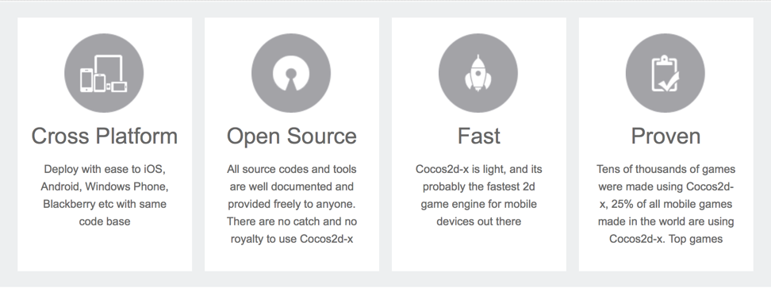
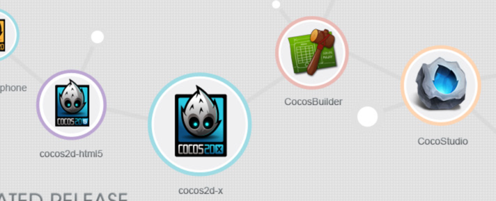
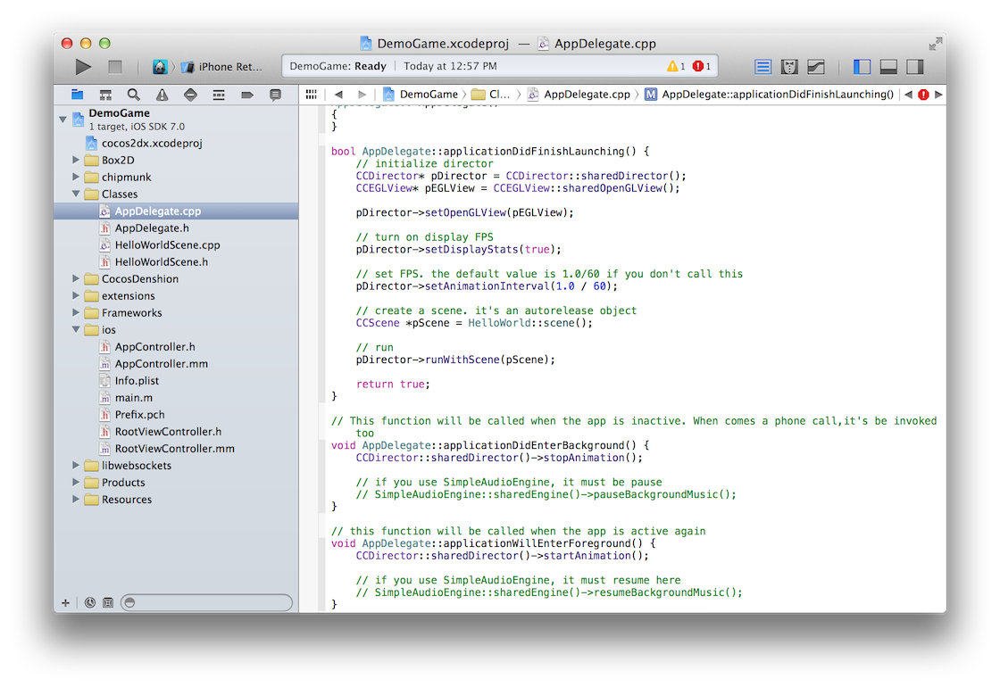
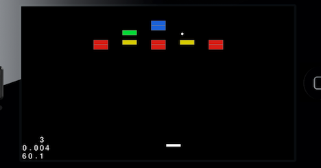

!SLIDE center
# Easy Cross Platform Games #

### Brought to you by Sean Copenhaver

!SLIDE incremental smbullets transition=fade
# Overview #
* Cocos2d-x Project
* Ecosystem
* Your First Project
* Organization
* Game Objects
* Physics
* Sound
* Demo

!SLIDE transition=fade
# Cocos2d-x Project #

!SLIDE transition=fade
# Ecosystem #

!SLIDE small commandline transition=fade
# Your First Project #

    $ ./create_project.py -project DemoGame -package com.me.demo -language cpp

    proj.ios        : Done!
    proj.android        : Done!
    proj.win32      : Done!
    proj.winrt      : Done!
    proj.wp8        : Done!
    proj.mac        : Done!
    proj.blackberry     : Done!
    proj.linux      : Done!
    proj.marmalade      : Done!
    New project has been created in this path: /Users/copenhas/code/cocos2d-x-2.2.0/projects/DemoGame
    Have Fun!

!SLIDE transition=fade
# Your First Project #

!SLIDE incremental smaller smbullets transition=fade
# Organization #

* _Director_ : A stack of scenes, can handle transitions
* _Scenes_ : In game scene and a Game over one, also use for menus, cutscenes, etc
* _Layers_ : Level layer and a Player level
 * Layers can accept user input
 * Great way to break up a scene (background, map, players, stats, etc)
* _Sprites_ : Lots of 'em
 * Supports loading sprite sheets
 * Caches them
 * Offers batch nodes for batch drawing to OpenGL

!SLIDE incremental smbullets transition=fade
# Game Objects #
* Autorelease?! (retain/release)
* new & init
* CCDictionary, CCArray, selectors
* Actions 
 * Transitions - move to a position over or fade out over a time period
 * Animations - skeleton and spritesheet based
 * Effects - waves, ripples, flip image

!SLIDE small incremental smbullets transition=fade
# Physics
Does offer basic intergration with 2 engines

## Box2d
* Strong Community
* JavaScript port (Box2d.js)
* C++ OOP style
* Units are meters and seconds

## Chipmunk
* Less to setup and configure
* All C, and fast
* A pro version? (Unity support)

!SLIDE incremental smbullets transition=fade
# Sound #
## CocosDehension
* Very simple sound engine
* No setup, just use
* Handles a single background track
* Multiple sound effects at once
* Mp3, wav, ogg: handles format by extension

!SLIDE incremental smbullets transition=fade
# Demo #

## To XCode we go! ##

!SLIDE small smbullets transition=fade
# Resources #
- Cocos2d-x [http://www.cocos2d-x.org]()
- Tiled [http://www.mapeditor.org]()
- CocosBuilder [http://cocosbuilder.com]()
- Box2d [http://box2d.org]()
- Chipmunk [http://chipmunk-physics.net]()
- My Crappy game [https://github.com/copenhas/ccbreakout]()
