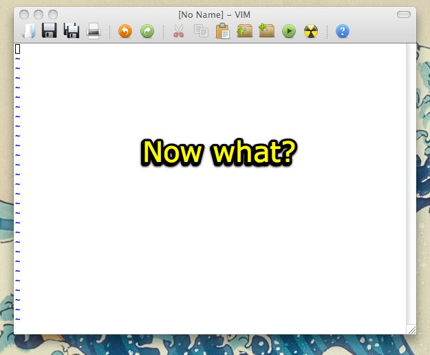
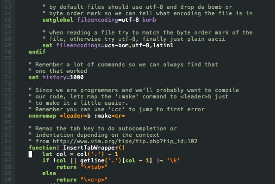
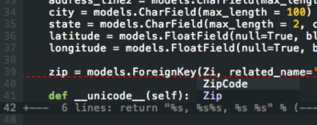
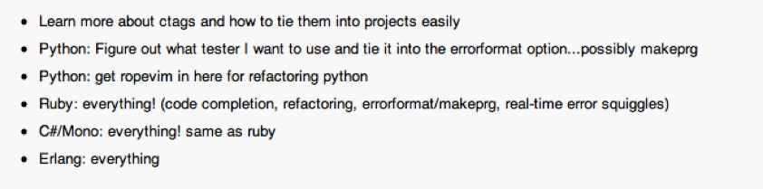

!SLIDE
# This VIM is a bomb #

### Brought to you by Sean Copenhaver

!SLIDE center
# Language of Text Editing #
### `vimsentence := [count]vimexpression`
### `vimexpression := vimcommand | <operator><motion>`
### `vimcommand := <action> | <motion>`

### _That is while in NORMAL mode_

!SLIDE center 
# WTF? (examples) #

### Delete next 3 words: 3dw

### Paste above line: P

### Move cursor down 2 paragraphs: 2}

!SLIDE center
# NORMAL Mode?? #
### Normal: where the magic happens - `<esc>`
### Visual: about as sexy as text highlighting gets - `v`
### Insert: what you are used to - `i`
### Command: tie-in all the extras - `:`

### __Try to stay in normal__

!SLIDE center
# What about as a development environment? #

!SLIDE center
# Some Assembly Required #

### but highly customizable

!SLIDE bullets incremental
# What you expect #
* code completion 
* error underlining
* snippets
* directory/project browsing
* cross file navigation 
* refactoring

!SLIDE center
# What You Get #

### VI compatibility out of box...sweet I can't backspace over newlines.

!SLIDE center
# You Customize # 
* ### VIM Script - VIM's own programming language
* ### Profiles - .gvimrc, .vimrc, & .vim/
* ### Plugins - huge community

!SLIDE center 
# VIM Starter Kit #
### Goal: Provide ready to go environment for VIM with a documented profile to learn off
#### Current just my dotfiles on github. (http://github.com/copenhas/dotfiles)

### Used several plug-ins to build my (ba-)bomb:

* ### **pathogen** - bundle style plugin management
* ### **autocmplpop** - auto-popup completion menu
* ### **nerdtree** - directory browsing
* ### **snipmate** - filetype code snippets
* ### **pyflakes** - python code checker
* ### **pythoncomplete** - python code completion

!SLIDE center
# Documented Profile
 

!SLIDE center
# What you want #

### Error underlining
### Code completion
### Folding/syntax

!SLIDE
# DEMO/CODE #

!SLIDE center
# //TODO #

!SLIDE center
# Go Forth and VIM #

!SLIDE center
# Questions #

!SLIDE
# Links that helped #
 * ### [VIM Docs](http://vimdoc.sourceforge.net/htmldoc/)
 * ### [A Byte of VIM](http://www.swaroopch.com/notes/Vim_en:Table_of_Contents)
 * ### [Seven Habits for Effective Text Editing](http://www.moolenaar.net/habits.html)
 * ### [Coming Home To VIM](http://stevelosh.com/blog/2010/09/coming-home-to-vim/#a-language-of-text-editing)
 * ### [How I Boosted my VIM](http://nvie.com/posts/how-i-boosted-my-vim/)

